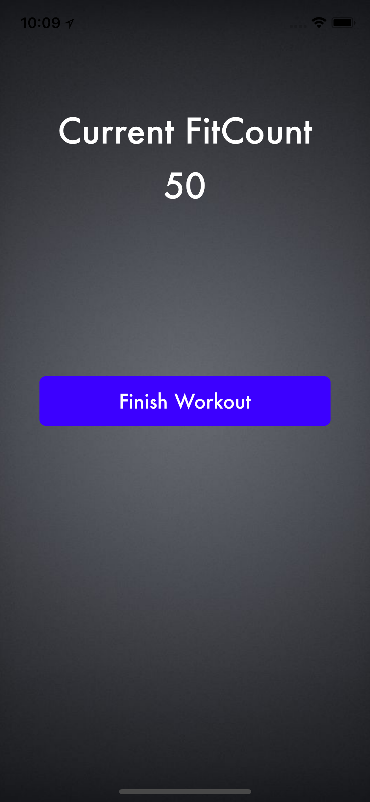

# Welcome to FitCount!

FitCount is a simple iOS/watchOS app aimed at fitness facilities that want to reward their members for working out hard in their facility. When activated FitCount will track the user's location and heart rate. Then, whenever the user is in their gym they will earn points added to their FitCount whenever their heart rate goes above a threshold. These points will be redeemable at their fitness facility for stuff...and things too!

## How it works

When you fire up FitCount if you are already a member you can enter your username and password and tap sign in to log in to your account...

... or tap sign up if you're not yet a member...

After signing in you will be greeted by the dashboard that greets you by name as well as shows you your total FitCount bank...

Once you are in your gym and ready to check in simply tap check in. Using your phones GPS, FitCount will check to see if you are in or near your gym.

If you are indeed within range of your gym tap start workout. At this point, FitCount starts reading the heart rate coming in from your third-party heart rate monitor. For every second, for the rest of your workout, that your heart rate is over 100 bpm you get a point! These points will continue to accrue throughout your workout...

...which you can also view on the Apple Watch companion app.

Whenever you are finished with your workout...

...simply tap finish workout. This brings you back to your dashboard with your FitCount updated to include your newly earned points!

